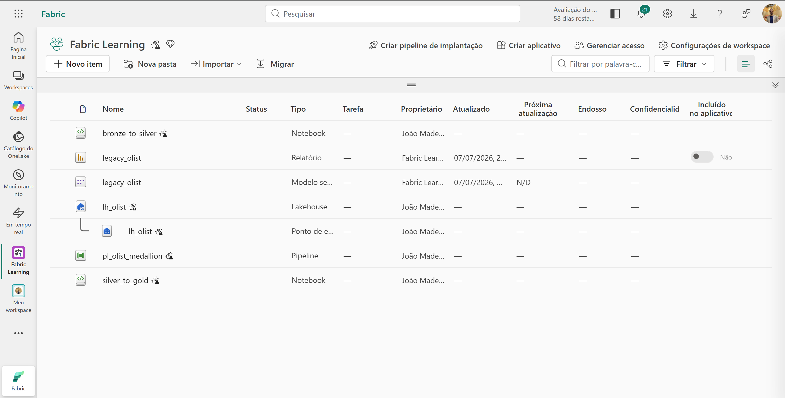
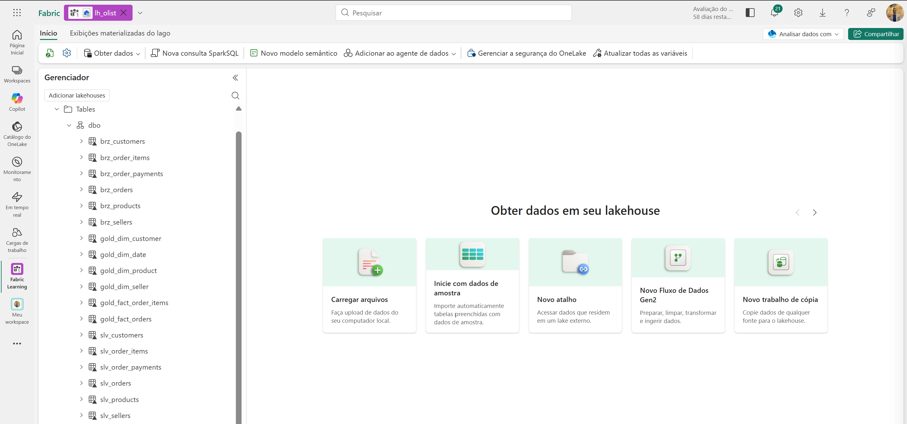
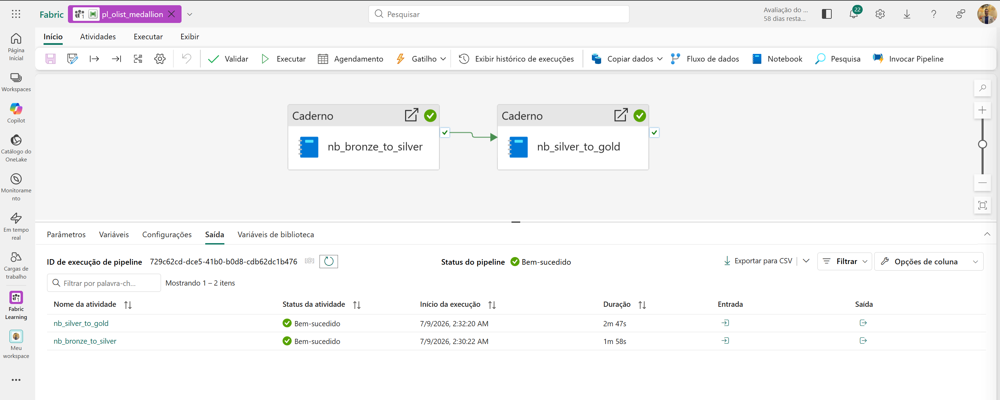
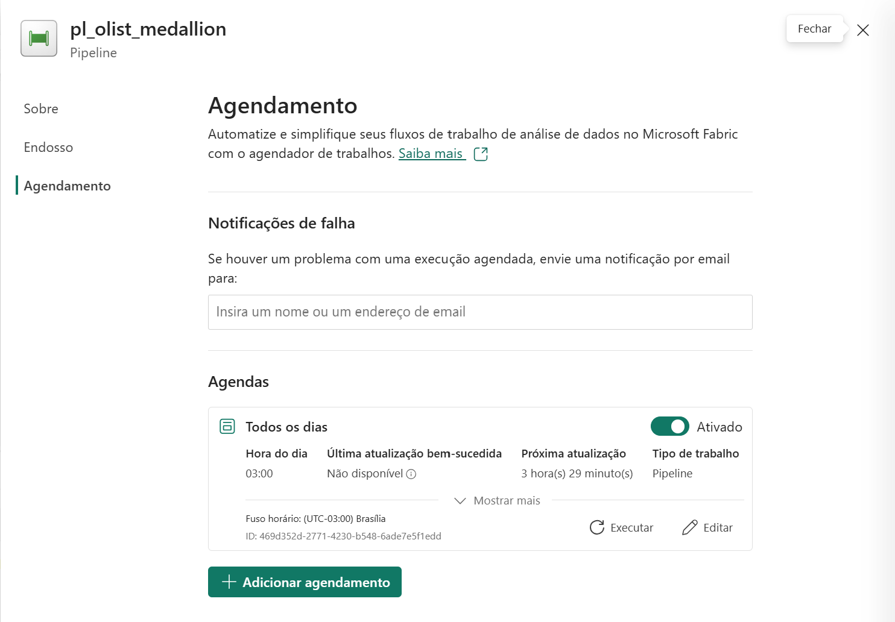
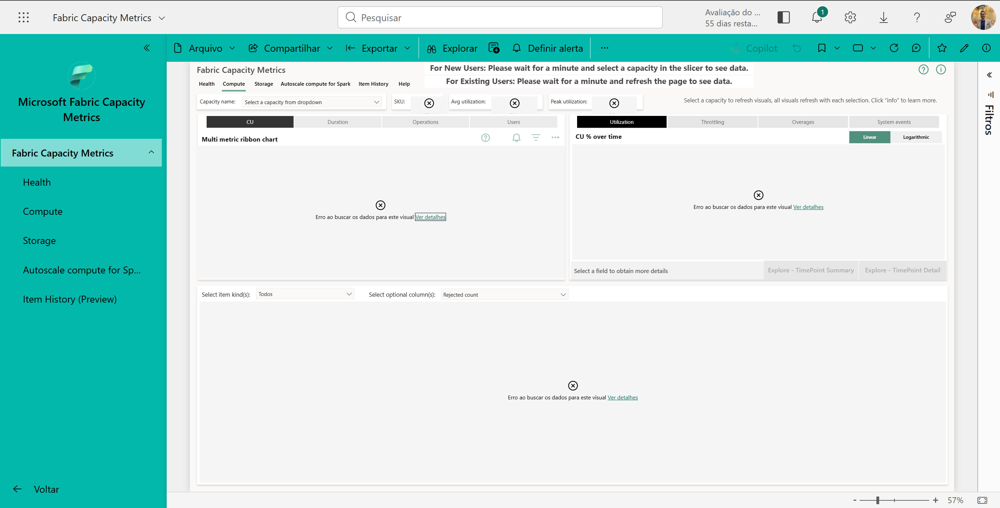

<h1 align="center">Migração Power BI Legado → Microsoft Fabric</h1>

<p align="center">
  <em>Projeto end-to-end simulando uma migração enterprise de um ambiente Power BI (import mode) para o Microsoft Fabric — Lakehouse/OneLake, Direct Lake, Pipelines, Notebooks PySpark, RLS/OLS e FinOps.</em>
</p>

<p align="center">
  
  
  
  
  
  
</p>

---

## Sobre o projeto

Este repositório documenta, de ponta a ponta, um projeto de **migração de dados e BI** de um ambiente **Power BI tradicional (import mode)** para a plataforma **Microsoft Fabric**. O objetivo é demonstrar, em escala reduzida mas realista, as competências técnicas e de negócio exigidas em projetos de migração enterprise: engenharia de dados, modelagem semântica, governança, performance/custos e a tradução técnico → negócio.

> O foco não é só "fazer funcionar", mas **documentar decisões de arquitetura, armadilhas reais e o comparativo antes/depois** — como num projeto de consultoria de verdade.

### Dataset

**[Olist Brazilian E-Commerce](https://www.kaggle.com/datasets/olistbr/brazilian-ecommerce)** (público) — cenário real de marketplace: vendas, logística e pagamentos. Multi-tabela por natureza e com colunas sensíveis, perfeito para exercitar RLS/OLS. Escopo: 6 tabelas (`orders`, `order_items`, `order_payments`, `customers`, `sellers`, `products`).

---

## Arquitetura

Arquitetura **Medallion** (Bronze → Silver → Gold) sobre OneLake, com o modelo semântico em **Direct Lake**:

```
   CSV Olist
      │
      ▼
┌───────────────┐   Notebook PySpark   ┌───────────────┐   Notebook PySpark   ┌───────────────┐
│    BRONZE     │  ───────────────────▶ │    SILVER     │  ───────────────────▶ │     GOLD      │
│  raw / Delta  │  limpeza + tipagem    │ limpo, tipado │  modelagem estrela   │  dim_* / fact_*│
└───────────────┘                       └───────────────┘                       └───────┬───────┘
        Lakehouse `lh_olist` (OneLake)                                                   │
                                                                                          ▼
                                                                            ┌───────────────────────┐
                                                                            │   Modelo Direct Lake  │
                                                                            │   + RLS / OLS + DAX   │
                                                                            └───────────┬───────────┘
                                                                                        ▼
                                                                                Relatório Power BI

           Orquestração: Data Pipeline (Bronze → Silver → Gold, agendado)
           Operação:     Fabric Capacity Metrics (consumo de CU, SKU F)
```

### Comparativo: legado → Fabric

| Camada | Antes (legado) | Depois (Fabric) |
|---|---|---|
| **Ingestão** | CSVs manuais no PBI Desktop | Lakehouse **Bronze** (OneLake, Delta) |
| **Transformação** | Power Query no `.pbix` | Notebooks **PySpark** (Silver/Gold) + Pipeline |
| **Modelo semântico** | Import mode (dados duplicados) | **Direct Lake** sobre a Gold |
| **Segurança** | RLS básico | **RLS + OLS** governados |
| **Operação** | Refresh agendado, sem visibilidade de custo | Pipeline + **Capacity Metrics** (CU) |

---

## Stack técnica

| Área | Ferramentas |
|---|---|
| **Plataforma** | Microsoft Fabric (Lakehouse, OneLake, Pipelines, Notebooks) |
| **Engenharia de dados** | PySpark, Delta Lake, arquitetura Medallion |
| **Modelagem & BI** | Direct Lake, Power BI, DAX, esquema estrela |
| **Governança** | Row-Level Security (RLS), Object-Level Security (OLS) |
| **FinOps** | Fabric Capacity Metrics, dimensionamento de SKU F |
| **Prep local** | Python, pandas, Kaggle API |

---

## Roadmap (4 dias)

| Dia | Foco | Entregável | Status |
|---|---|---|:---:|
| **1** | Baseline legado + Lakehouse Bronze | `.pbix` import mode + Bronze no `lh_olist` | Concluído |
| **2** | Transformação Silver/Gold + Pipeline | Notebooks PySpark + Pipeline orquestrado | Concluído |
| **3** | Direct Lake + Segurança | Modelo Direct Lake com RLS/OLS testados | Concluído |
| **4** | Capacidade, custos & negócio | Análise de CU/SKU + plano de comunicação | Concluído |

---

## Execução no Fabric

Registro visual da execução no portal (prints completos e indexados em [`prints/`](prints/)):

<table>
  <tr>
    <td width="50%" valign="top">
      <br>
      <sub><b>Workspace</b> — "Fabric Learning" com os itens do projeto: Lakehouse, notebooks, pipeline e modelo semântico.</sub>
    </td>
    <td width="50%" valign="top">
      <br>
      <sub><b>Medallion materializado</b> — camadas <code>brz_*</code>, <code>slv_*</code> e <code>gold_*</code> sob o schema <code>dbo</code> do Lakehouse <code>lh_olist</code>.</sub>
    </td>
  </tr>
  <tr>
    <td width="50%" valign="top">
      <br>
      <sub><b>Pipeline</b> — <code>pl_olist_medallion</code> executado ponta a ponta (Bronze → Silver → Gold), atividades bem-sucedidas.</sub>
    </td>
    <td width="50%" valign="top">
      <br>
      <sub><b>Orquestração</b> — pipeline agendado para execução diária às 03:00.</sub>
    </td>
  </tr>
</table>

<p align="center">
  <br>
  <sub><b>Limitação de ambiente (FinOps)</b> — o Capacity Metrics App não conecta à capacity <em>trial</em> (<code>Error obtaining data location</code>); o consumo foi medido pelo <b>Monitoring Hub</b>. Ver <a href="docs/capacidade-custos.md">docs/capacidade-custos.md</a>.</sub>
</p>

---

## Estrutura do repositório

```
fabric-migration-olist/
├── README.md
├── data/                          # scripts de download/preparação (dados brutos NÃO versionados)
│   ├── download_olist.py
│   └── README.md
├── pbi-legacy/                    # modelo import mode — o "antes"
│   └── legacy_olist.pbix
├── notebooks/
│   ├── bronze_to_silver.ipynb     # limpeza + tipagem (PySpark)
│   ├── silver_to_gold.ipynb       # modelagem dimensional (esquema estrela)
│   └── seguranca_como_codigo.py   # RLS + OLS via semantic-link-labs (security as code)
├── pipeline/                      # definição do Data Pipeline Fabric
├── docs/
│   ├── plano-projeto.md           # plano completo do projeto
│   ├── arquitetura.md             # Lakehouse vs Warehouse, Delta, particionamento
│   ├── seguranca-rls-ols.md       # papéis, DAX de RLS, matriz de teste
│   ├── capacidade-custos.md       # CU, SKU F, monitoramento
│   └── plano-comunicacao-migracao.md
└── dax/
    └── medidas.md                 # medidas DAX comentadas (versões Gold + legado)
```

---

## Destaques & aprendizados

- **Armadilha de qualidade de dados (locale decimal):** CSVs com `.` decimal + Power BI em pt-BR tipavam `price` como inteiro, inflando a receita em **×100** (R$ 1,36 bi vs. R$ 13,6 mi reais). Resolvido com `type number` + cultura `en-US` no `Table.TransformColumnTypes`. → [`pbi-legacy/README.md`](pbi-legacy/README.md)
- **Nuance de grão no RLS:** `seller_state` vive no grão de item, não de pedido — um pedido com sellers de estados diferentes aparece para múltiplos vendedores. Comportamento esperado de marketplace, documentado. → [`docs/seguranca-rls-ols.md`](docs/seguranca-rls-ols.md)
- **Direct Lake vs. Import:** mesma lógica DAX, mas sem cópia de dados nem refresh — leitura direta do Delta. → [`dax/medidas.md`](dax/medidas.md)
- **Segurança como código:** o Tabular Editor 2 (grátis) falha ao salvar OLS em Direct Lake, então RLS + OLS foram aplicados por **`semantic-link-labs`** num notebook — versionável e reproduzível. → [`notebooks/seguranca_como_codigo.py`](notebooks/seguranca_como_codigo.py)
- **Restrições de ambiente contornadas (como numa migração real):** Git nativo do Fabric bloqueado pelo tenant → versionamento manual no GitHub; "Test as role" incompatível com SSO em Direct Lake → RLS/OLS validados por **XMLA/DAX Studio** com `EffectiveUserName`; Capacity Metrics App não suporta capacity trial → consumo medido pelo **Monitoring Hub**. → [`docs/seguranca-rls-ols.md`](docs/seguranca-rls-ols.md)
- **FinOps:** carga medida real (pipeline ~4m24s) mostrou que o custo é dirigido por **overhead de sessão Spark**, não por volume de dados — SKU se dimensiona pela **camada de consumo/licenciamento** (**F64** = Power BI Pro grátis para consumidores), não pela transformação. → [`docs/capacidade-custos.md`](docs/capacidade-custos.md)

---

## Como reproduzir

```bash
# 1. Baixar e preparar os dados (não versionados)
pip install -r requirements.txt
python data/download_olist.py        # requer credenciais do Kaggle

# 2. No Microsoft Fabric:
#    - criar Lakehouse `lh_olist` e subir data/raw/ como Bronze (brz_*)
#    - importar e rodar os notebooks (bronze_to_silver, silver_to_gold)
#    - criar o modelo Direct Lake sobre a Gold e aplicar RLS/OLS
```

Detalhes em [`data/README.md`](data/README.md) e [`docs/plano-projeto.md`](docs/plano-projeto.md).

---

## Métricas de negócio (DAX)

Receita total / por período · Ticket médio · % frete sobre venda · SLA de entrega (prazo real vs. promessa). Baseline validado: **Receita ~R$ 13,6 mi**, **Ticket ~R$ 137**, **% Frete ~20%**.

---

<p align="center">
  <sub>Projeto de estudo e portfólio · Dados públicos Olist (CC BY-NC-SA 4.0) · Uso não comercial</sub>
</p>
